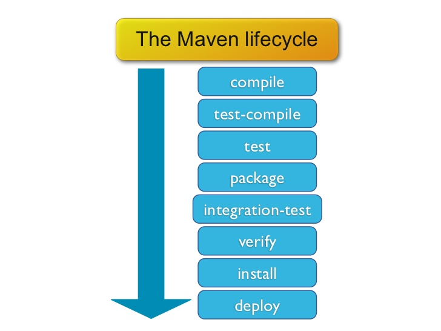
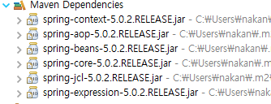

# 프로젝트 환경 구성

---

## MAVEN

메이븐은 빌드 과정의 복잡성과 라이브러리의 의존성 문제 해결을 위해 탄생

프로젝트 객체 모델 개념(PM) 기반으로 균일한 빌드 과정 및 라이브러리 의존성을 관리

ex) 영수증과 유사

---

### POM.xml 구성

* 기본 구성

```xml
  <modelVersion>4.0.0</modelVersion> <!-- POM 모델 버전 -->

  <groupId>com.study</groupId>  <!-- 프로젝트 고유 식별자 -->
  <artifactId>example</artifactId> <!-- 프로젝트 고유 ID -->
  <version>1.0</version> <!-- 버전 -->
  <packaging>jar</packaging> <!-- 패키징 유형 -->

  <name>예제</name><!-- 프로젝트 명 -->
  <description>예제입니다</description> <!-- 설명 -->
```

- 패키징 유형에 따라 빌드 실행 요소가 변경 됨
- 메이븐 패키지는 폴더 구성이 정형화 되어 있음

---

* 저장소 설정 

``` xml 
<repositories>
  <!-- 라이브러리 검색 저장소 -->
  <repository>
      <id>Central</id>
      <name>repo1.maven.org</name>
      <url>https://repo1.maven.org/maven2/</url>
  </repository>
</repositories>
```

- https://repo.maven.apache.org/maven2/ 기본 검색 저장소
- https://mvnrepository.com/ 라이브러리 검색
  
---

* 변수 설정

동일 라이브러리 버전을 일괄적 관리를 위해 

```xml
  <!-- 변수 설정 -->
  <properties>
    <spring.version>5.2.0.RELEASE</spring.version>
  </properties>

  <!--
    ${spring.version} 사용 가능
  -->
```

---
* 라이브러리 관리

```xml
  <!-- 종속성 -->
  <dependencies>
    <dependency>
      <groupId>org.springframework</groupId>
      <artifactId>spring-context</artifactId>
      <version>${spring.version}</version>
      <scope>compile</scope>
    </dependency>

    <!-- 로컬에서 제공할 경우 -->
    <dependency>
      <groupId>com.study</groupId>
      <artifactId>example</artifactId>
      <version>1.0</version>
      <scope>system</scope>
      <systemPath>${basedir}/src/main/webapp/WEB-INF/lib/example.jar</systemPath>
    </dependency>
  </dependencies>
```

---

#### Scope 관리

- Compile: 기본 값, 해당 프로젝트에 종속성 관계(무조건 있어야 함)
- provided: 서버 및 WAS에서 제공, 필요하지만 패키징 불포함 ex) Servlet, JDBC
- runtime: 컴파일에서는 불필요하지만, 실행 과정에서는 필요, 패키징 불포함
- test: 테스트 빌드 및 과정에서만 필요, 패키징 불포함
- system: 저장소에서 관리되지 않으며, 로컬에서 제공, `systemPath` 명시적 위치 표시

---

#### 생명 주기 Life Cycles

- validate: 프로젝트의 정보 검증
- compile: 프로젝트 코드 컴파일
- test: 소스 코드 테스트
- package: 컴파일된 소스를 설정된 패키지 유형에 따라 처리
- verify: 통합 테스트 결과에 대한 검사를 실행하여 품질 기준을 충족하는지 확인하는 단계
- install: 로컬 저장소로 배포
- deploy: 원격 저장소에 최종 패키지 배포
- clean: 이전 빌드에서 생성된 코드 정리(target 폴더)

---



---

## Tip

* 포맷 등, 인터넷이 안될 경우 로컬 저장소 압축 사용 가능 
* 로컬 레파지토리 구성 솔루션 (nexus, Artifactory) 
* 로컬 저장소 기본 경로: 사용자 홈 폴더\.m2\repository 

```xml
<settings ...>
  <!-- 저장소 위치 -->
  <localRepository>${user.home}/.m2/repository</localRepository>
</settings>
```

---

### 의존 전이(Transitive Dependencies)
  * Tree구조로 참조하면서 라이브러리 관계 정보 수집 다운로드

```xml
<dependencies>
  <dependency>
      <groupId>org.springframework</groupId>
      <artifactId>spring-context</artifactId>
      <version>5.0.2.RELEASE</version>
  </dependency>
</dependencies>
<!-- * maven - dependences - optional: 의존성 상속하지 않음, 컴파일에는 사용하지만 배포하지 않음(필요할 때 사용)  -->
```




---

### 그레이들 Gradle

* 메이븐과 유사 기능
* 메이븐의 xml 방식에서 groovy와 유사 도메인으로 간단하게 구성
* java외 다양한 언어 지원
* if, else 등 로직 구현 가능

- https://gradle.org/

---


## SpringFrameWork

```java
@Configuration
public class AppContext {

	// 함수명이 이름 
	@Bean
	public Greeter greeter() {
		
		Greeter g = new Greeter();
		g.setFormat("%s, 안녕하세요");
		return g;
	}
}
```
---
### @Configuration

구성 설정 관계 읽어서 시작

```
// Config 설정 파일 로드
AnnotationConfigApplicationContext ctx = 
    new AnnotationConfigApplicationContext(AppContext.class);

// 오버로딩 
// N개의 @Configuration 정보 읽기
new AnnotationConfigApplicationContext(AppContext.class, AppContext.class);

// 패키지 아래 @Configuration 정보 읽기
new AnnotationConfigApplicationContext("chap02");
```

---

### @Bean

- 기능을 정의한 고유한 객체
- 스프링이 관리하는 객체 - 싱글톤

```java
@Bean
public Greeter greeter()
Greeter g = ctx.getBean("greeter", Greeter.class);

@Bean
public Greeter greeter1()
Greeter g1 = ctx.getBean("greeter1", Greeter.class);
```
---

### 싱글톤(동일한 객체 사용)

```java
Greeter g1 = ctx.getBean("greeter", Greeter.class);
Greeter g2 = ctx.getBean("greeter", Greeter.class);
Greeter g3 = new Greeter();
System.out.println("(g1 == g2) = " + (g1 == g2));
// (g1 == g2) = true
System.out.println("(g1 == g2) = " 
  + (g1.hashCode() == g2.hashCode()) + " hashCode="+ g1.hashCode());
// (g1 == g2) = true hashCode=293002476
System.out.println(g3.hashCode());
// 302870502
```
---

## 참고

- https://maven.apache.org/ref/3.8.4/maven-model/maven.html POM.xml 정의
- https://maven.apache.org/ref/3.8.4/maven-core/lifecycles.html 메이븐 라이프사이클
- https://maven.apache.org 메이븐
- https://repo.maven.apache.org/maven2/ 기본 검색 저장소
- https://mvnrepository.com/ 저장소
- https://www.sonatype.com/products/repository-pro Nexus 레파지토리 구성
- https://marp.app/